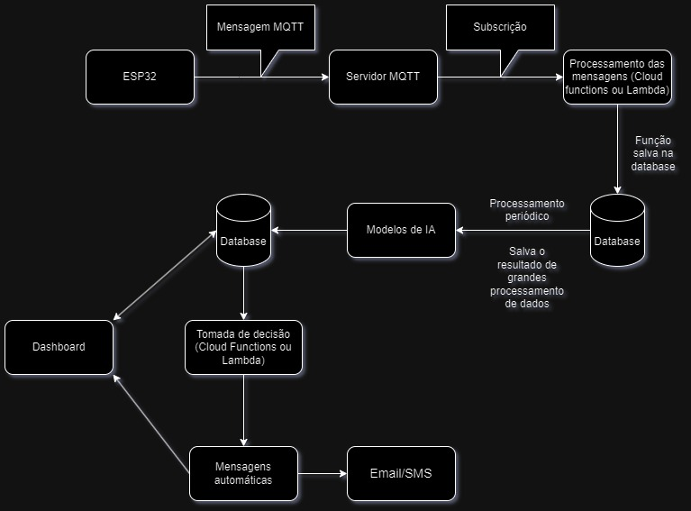

# FIAP - Faculdade de Informática e Administração Paulista

 

# Sprint 1 - Reply 

## Nome do grupo

## 👨‍🎓 Integrantes: 
- <a href="">Alice C. M. Assis - RM 566233</a>
- <a href="">Leonardo S. Souza - RM 563928</a>
- <a href="">Lucas B. Francelino - RM 561409</a> 
- <a href="">Pedro L. T. Silva - RM 561644</a> 
- <a href="">Vitor A. Bezerra - RM 563001</a>

## 👩‍🏫 Professores:
### Tutor(a) 
- <a href="https://www.linkedin.com/company/inova-fusca">Lucas Gomes Moreira</a>
### Coordenador(a)
- <a href="https://www.linkedin.com/company/inova-fusca">André Godoi Chiovato</a>

## 📜 Descrição

Este projeto visa o desenvolvimento de uma solução com foco em controle inteligente de processos, monitoramento, dashboards, alertas automáticos e sistemas de predição. Com isso, busca ajudar seus clientes a alcançarem excelência operacional, digitalizando seus ambientes e integrando dispositivos físicos e digitais para gerar dados e insights valiosos em tempo real.

## 🛠 Tecnologias utilizadas
- Python
- NumPy
- Pandas
- Matplotlib
- Scipy
- Seaborn
- C++
- Docker
- Oracle Database / PostgreSQL / Amazon RDS ou Firebase
- MqTT
- TensorFlow / PyTorch

## Considerações

**Como os dados serão coletados a partir de sensores?**

**R:** Os dados serão coletados a partir de sensores conectados a um ESP32 utilizando o protocolo MQTT. O ESP32 atuará como um cliente MQTT, publicando os dados dos sensores em tópicos específicos. O servidor MQTT, que pode ser hospedado em um serviço de nuvem ou em um servidor local, receberá essas mensagens e as encaminhará para uma fila a qual distribuirá para os serviços inscritos.

**Onde os dados serão armazenados?**

**R:** Os dados serão armazenados em um banco de dados em nuvem utilizando Amazon RDS (PostgreSQL) para dados estruturados (como métricas de sensores e logs) e Amazon S3 para dados brutos e arquivos temporários.
Por que essa escolha?
Escalabilidade Automática: O Amazon RDS ajusta capacidade conforme a demanda sem downtime, crucial para linhas de produção com picos de operação.
Alta Disponibilidade: Replicação multi-AZ garante 99,99% de uptime (SLA AWS), evitando paradas não planejadas.
Integração com IA: Compatibilidade nativa com serviços AWS como Lambda e SageMaker, facilitando a implementação de modelos de ML.
Custo-Benefício: Amazon S3 armazena dados brutos a baixo custo (US$ 0,023/GB/mês), enquanto RDS oferece backups automatizados gratuitos.

**Como será feita a integração com modelos de IA?**

**R:** A integração com modelos de IA será realizada através de APIs RESTful. Os dados coletados dos sensores serão enviados para um serviço de backend responsável por executar os modelos de IA, que poderão ser implementados localmente em Python (utilizando bibliotecas como TensorFlow ou PyTorch) ou utilizando plataformas de IA na nuvem, de acordo com a necessidade de escalabilidade e desempenho do projeto.

Entre as soluções em nuvem consideradas para a execução dos modelos estão:
- Vertex AI (Google Cloud): Ideal para treinar, implantar e gerenciar modelos de Machine Learning em escala, com integração nativa ao BigQuery e pipelines automatizados.

- AWS AI (Amazon SageMaker): Permite treinar e implantar modelos rapidamente com suporte para modelos customizados e otimizados, além de oferecer auto escalonamento e monitoramento.

- OpenAI (ChatGPT API): Pode ser usado para análises baseadas em linguagem natural, geração de insights automatizados ou interação com usuários de forma inteligente.

O sistema escolherá a melhor plataforma com base na natureza do modelo, nos requisitos de latência e custo, e na integração com o restante da arquitetura (Google Cloud, AWS ou OpenAI). Os resultados das previsões serão enviados de volta ao sistema, podendo ser armazenados no banco de dados, visualizados em dashboards ou utilizados para acionar alertas automáticos.

Fizemos uma estimativa de custo utilizando um cenário hipotético de uso para os serviços da Amanzon e Google e Open AI.

💻 AWS AI (Amazon SageMaker)

1. Computação
- Instância: ml.g4dn.xlarge
- Duração diária: 6 horas
- Dias de uso no mês: 20
- Total de horas: 6 horas/dia × 20 dias = 120 horas
- Custo por hora: USD 0,7364
- Custo total de computação: 120 horas × USD 0,7364 = USD 88,368

2. Armazenamento
- Tipo de armazenamento: SSD de uso geral
- Tamanho: 5 GB
- Custo por GB/mês: USD 0,1125
- Custo total de armazenamento: 5 GB × USD 0,1125 = USD 0,5625
- Total mensal estimado: USD 88,93

💻 Vertex AI (Google Cloud)

1. Computação
- Instância: n1-standard-8 com GPU NVIDIA T4
- Duração diária: 6 horas
- Dias de uso no mês: 20
- Total de horas: 6 horas/dia × 20 dias = 120 horas
- Custo por hora:
  - n1-standard-8: USD 0,379
  - GPU NVIDIA T4: USD 0,35
  - Total por hora: USD 0,729
- Custo total de computação: 120 horas × USD 0,729 = USD 87,48

2. Armazenamento
- Tipo de armazenamento: SSD padrão
- Tamanho: 5 GB
- Custo por GB/mês: USD 0,17
- Custo total de armazenamento: 5 GB × USD 0,17 = USD 0,85
- Total mensal estimado: USD 88,33

💻 OpenAI (ChatGPT API)

1. Cálculo de Tokens
- Chamadas por dia: 6 horas/dia × 10 chamadas/hora = 60 chamadas/dia
- Chamadas por mês: 60 chamadas/dia × 20 dias = 1.200 chamadas/mês
- Tokens de entrada por mês: 1.200 chamadas × 500 tokens = 600.000 tokens
- Tokens de saída por mês: 1.200 chamadas × 500 tokens = 600.000 tokens

 2. GPT-4.5
- Custo por 1.000 tokens de entrada: USD 0,075
- Custo por 1.000 tokens de saída: USD 0,15
- Custo de entrada: 600.000 tokens × (USD 0,075 / 1.000) = USD 45,00
- Custo de saída: 600.000 tokens × (USD 0,15 / 1.000) = USD 90,00
- Total mensal estimado: USD 135,00

Conclusão: Os custos da Amazon e Google são aproximados, mas os custos da Open AI são significativamente mais elevados.

**Onde ocorrerá o processamento?**

**R:** O processamento dos dados coletados dos sensores ocorrerá em um servidor local ou na nuvem, dependendo da arquitetura escolhida. O uso de contêineres Docker permitirá que o sistema seja facilmente escalável e portátil, facilitando a implementação em diferentes ambientes. A escolha entre processamento local ou na nuvem dependerá das necessidades específicas da empresa, da infraestrutura disponível e preocupação com o sigilo dos dados.

## Requisitos Técnicos e Funcionais

1) Linguagens e ferramentas adequadas para análise de dados e Machine Learning

- Python: Linguagem de programação amplamente utilizada para análise de dados e Machine Learning, com bibliotecas como NumPy, Pandas, Matplotlib e Scipy.

2) Como os dados serão coletados, incluindo o tipo de coleta (simulada ou planejada via sensores como ESP32), armazenados e processados?

- Coleta de dados: Os dados serão coletados a partir de sensores conectados a um ESP32 utilizando o protocolo MQTT. O ESP32 atuará como um cliente MQTT, publicando os dados dos sensores em tópicos específicos. O servidor MQTT, que pode ser hospedado em um serviço de nuvem ou em um servidor local, receberá essas mensagens e as encaminhará para uma fila a qual distribuirá para os serviços inscritos. Um desses serviços será o de armazenagem de dados, que cuidará de sua armazenagem em um dos bancos de dados citados anteriormente.

3) Qual é a justificativa para a escolha de um banco de dados local ou na núvem? Qual é a sua escabilidade e viabilidade em relação ao projeto?

- A escolha entre um banco de dados local ou na nuvem deve considerar as necessidades específicas do projeto, a infraestrutura disponível e o nível de exigência quanto disponibilidade dos dados.

- Banco de dados local:
    A implementação local demanda um investimento inicial elevado, com custos associados à aquisição de servidores, infraestrutura de TI e mão de obra especializada para instalação e manutenção. Além disso, a         escalabilidade tende a ser limitada, exigindo novos aportes sempre que for necessário expandir a capacidade. No entanto, pode apresentar melhor desempenho em ambientes com alto volume de acesso interno e menor      dependência de conectividade externa.

- Banco de dados na nuvem:
    Soluções em nuvem oferecem maior flexibilidade e disponibilidade, o modelo de cobrança por demanda reduz o custo inicial e possibilita um controle mais eficiente do orçamento, com escalabilidade praticamente      automática conforme o crescimento do projeto. Além disso, os serviços em nuvem geralmente incluem atualizações e suporte técnico contínuo, o que reduz a necessidade de equipe técnica dedicada.

- Conclusão:
    Para o nosso projeto, os bancos de dados na nuvem apresentam maior viabilidade financeira e operacional, oferecendo uma solução escalável, com alta disponibilidade e menor custo inicial. Já os bancos de dados     locais podem ser considerados em situações específicas que demandem desempenho interno superior, desde que se justifique o investimento necessário.

4) Qual é o potencial de uso de serviços em nuvem (como AWS EC2, RDS, Lambda ou similares) na arquitetura proposta, mesmo que simulados na etapa atual?

A solução utilizará serviços em nuvem da AWS para garantir escalabilidade, baixo custo inicial e integração com IA. As principais escolhas são:
AWS IoT Core: Substitui servidores MQTT locais, gerenciando conexões dos sensores ESP32 com autenticação segura (TLS).
Amazon RDS (PostgreSQL): Armazena dados processados com alta disponibilidade e backups automáticos.
AWS Lambda: Executa modelos leves de Machine Learning (ex: detecção de anomalias) sem custo quando ocioso.
Amazon EC2: Roda modelos complexos (ex: TabTransformer) em instâncias escaláveis.
Por que nuvem?
Custo reduzido: Camada gratuita da AWS permite testes sem investimento inicial.
Pronto para produção: A mesma arquitetura escala para cenários reais sem modificações.
Simulação fácil: Dados simulados (ex: gerados com Pandas) podem ser enviados para a AWS IoT Core como se fossem de sensores reais.
Cenário realista: Para 10 sensores enviando dados a cada 5 segundos, o custo estimado é de US$ 50-100/mês – viável mesmo para pequenas indústrias.

5) Como os dados serão processados e analisados? Quais algoritmos de Machine Learning serão utilizados?

- Processamento de dados:    Os dados coletados dos sensores serão processados em tempo real utilizando Python, com bibliotecas como NumPy, Pandas e SciPy. O processamento incluirá etapas como limpeza, transformação, integração e filtragem:

    Limpeza: Esta etapa envolve a remoção de dados errôneos ou inconsistentes, como valores ausentes, duplicados ou fora de contexto. O objetivo é garantir que os dados sejam precisos e representem a realidade do       que está sendo medido pelos sensores.
  
    Transformação: Nessa fase, os dados são convertidos em formatos ou escalas mais adequados para análise. Isso pode incluir a normalização de valores, a conversão de variáveis categóricas em numéricas ou a            aplicação de funções matemáticas para ajustar os dados.
  
    Integração: Caso os dados venham de diferentes fontes ou sensores, a integração combina essas informações em um único conjunto, garantindo que todas as variáveis relevantes sejam consideradas de forma coesa e       sem sobreposição.
  
    Filtragem: Nessa etapa, são selecionados apenas os dados relevantes para o objetivo da análise. Isso pode envolver a remoção de valores fora de um intervalo específico ou a escolha de dados de interesse com         base em critérios predefinidos.

    Essas etapas garantirão que os dados estejam preparados de forma eficiente para as análises e modelagens posteriores.

- Análise de dados:    A análise dos dados será realizada utilizando algoritmos de Machine Learning, com uma combinação de modelos para tratamento em tempo real (ou em curtos intervalos de tempo) e modelos mais         robustos para volumes maiores de dados.

    Para dados processados em tempo real ou em curtos períodos de tempo (algumas vezes ao dia), será utilizada uma combinação dos modelos Random Forest e Isolation Forest, que rodarão localmente, oferecendo             respostas rápidas e eficazes.

    Já para grandes volumes de dados acumulados ao longo de períodos mais longos (a definir com o cliente), a análise será feita utilizando modelos robustos, como o TabTransformer ou o     XGBoost, executados em        nuvem.
  
    Esses modelos são capazes de lidar com grandes quantidades de dados e oferecem uma análise detalhada e precisa. Com a divisão entre modelos para análise em tempo real e modelos voltados a grandes volumes de         dados, o sistema oferecerá maior flexibilidade e eficiência, entregando respostas rápidas quando necessário e análises aprofundadas para o planejamento estratégico.

- Predição:    Os modelos de Machine Learning serão utilizados para prever eventos futuros com base nos dados dos sensores. As previsões geradas poderão acionar alertas automáticos, alimentar análises e gerar informações simples no dashboard interativo, além de embasar análises mais complexas para decisões específicas, como determinar se vale a pena realizar uma manutenção e qual o melhor momento para isso.

- Visualização de dados:    A visualização será feita com o uso de bibliotecas como Matplotlib e Seaborn. Gráficos e dashboards serão utilizados para apresentar os resultados das análises em tempo real e as previsões geradas pelos modelos. Esses recursos permitirão aos usuários monitorar as informações de forma eficiente, tanto para ações imediatas quanto para o planejamento de longo prazo.

- Alertas automáticos:    Os alertas automáticos serão acionados com base nas previsões dos modelos de Machine Learning. Eles poderão ser enviados por e-mail, SMS ou por meio de notificações em um aplicativo, permitindo uma resposta rápida. Esses alertas se subdividem em dois tipos: alertas de status em tempo real, gerados pelos modelos mais leves, e alertas e relatórios mais completos, baseados em análises de longo prazo realizadas pelos modelos mais robustos.

## Esboço da arquitetura

</a>

## Estratégia de coleta de dados

R: Inicialmente, os dados poderão ser coletados de forma simulada, ou seja, utilizando scripts que geram dados artificiais com base em faixas realistas, 
padrões esperados ou históricos de sensores. Essa abordagem é útil durante a fase de desenvolvimento e testes, enquanto o hardware (como os sensores ESP32) 
ainda não estiver plenamente operacional ou disponível fisicamente.

Posteriormente, a coleta passará a ser planejada e realizada com dispositivo físicos, como o microcontrolador ESP32, conectado a diversos sensores (de movimento, temperatura, 
umidade, entre outros). O ESP32 atuará como um cliente MQTT, enviando dados em tempo real para um servidor MQTT. Esse servidor será responsável por distribuir 
as mensagens aos serviços interessados, incluindo os responsáveis por armazenar, processar e analisar os dados.

Etapas da estratégia de coleta:

1. Coleta (Simulada ou Planejada):
   - Simulada: Geração de dados via scripts Python, com base em parâmetros pré-definidos.
   - Planejada (real): Sensores físicos conectados a microcontroladores (ESP32), enviando dados via MQTT.

2. Transmissão:
   - Protocolo MQTT será usado para transmitir os dados do ESP32 para o servidor central.

3. Armazenamento:
   - Os dados poderão ser armazenados em bancos de dados relacionais (PostgreSQL, Oracle, Amazon RDS) ou NoSQL (Firebase), dependendo da necessidade de estruturação, escalabilidade e tempo de consulta.

4. Processamento:
   - O processamento ocorrerá localmente ou na nuvem utilizando bibliotecas como NumPy, Pandas e SciPy, realizando etapas de limpeza, transformação, integração e filtragem.
   - Os dados também serão enviados para APIs com modelos de IA, conforme demonstrado no "<a href="#img123">Esboço da arquitetura</a>".

## Plano inicial de desenvolvimento

 ✅ Fase 1: Coleta de Dados
- **Membro responsável:** Alice Caroline  
- 📆 *13 de Maio a 9 de Junho*
- Tarefas:
  - Coletar dados via MQTT usando ESP32
  - Armazenar em banco relacional ou NoSQL
  - Processamento inicial com Python (NumPy, Pandas, SciPy)

---

 📊 Fase 2: Análise de Dados
- **Membros responsáveis:** Vitor Albuquerque e Leonardo Sampaio
- 📆 *10 de Junho a 9 de Julho*
- Tarefas:
  - Análise com regressão, árvore de decisão e redes neurais
  - Visualização com Matplotlib e Seaborn
  - Criação de dashboards com insights

---

 🔮 Fase 3: Predição
- **Membro responsável:** Vitor Albuquerque
- 📆 *15 de Julho a 18 de Agosto*
- Tarefas:
  - Modelos preditivos com alertas automáticos
  - Envio de alertas por email, SMS ou app

---

 🔌 Fase 4: Integração com APIs
- **Membro responsável:** Lucas Basseto
- 📆 *18 de Agosto a 15 de Setembro*
- Tarefas:
  - Integração com APIs RESTful usando Flask ou FastAPI
  - Documentação com Swagger ou Postman
  - Testes automatizados com `pytest` ou `unittest`

---

 🐳 Fase 5: Contêineres Docker
- **Membro responsável:** Pedro Lucas
- 📆 *16 de Setembro a 13 de Outubro*
- Tarefas:
  - Dockerfile para cada serviço
  - Orquestração com Docker Compose
  - Testes automatizados dos containers

---

 ✅ Fase 6: Testes Automatizados
- **Membros responsáveis:** Pedro Lucas e Lucas Basseto
- 📆 *14 de Outubro a 03 de Novembro*
- Tarefas:
  - Testes unitários, integração e aceitação
  - CI para rodar testes automaticamente a cada commit

---

 📚 Fase 7: Documentação
- **Membro responsável:** Leonardo Sampaio
- 📆 *04 de Novembro a 17 de Novembro*
- Tarefas:
  - Documentação clara e atualizada
  - Uso de ferramentas automáticas de geração de doc

---

 🔧 Fase 8: Melhorias
- **Membros responsáveis:** Todos do grupo
- 📆 *20 de novembro a 7 de dezembro*
- Tarefas:
  - Testes de carga e estresse
  - Monitoramento e ajustes
  - Melhorias na interface

## 🗃 Histórico de lançamentos

* 0.1.0 - 04/05/2025
    *

## 📋 Licença

<a property="dct:title" rel="cc:attributionURL" href="https://github.com/agodoi/template">MODELO GIT FIAP</a> por <a rel="cc:attributionURL dct:creator" property="cc:attributionName" href="https://fiap.com.br">Fiap</a> está licenciado sobre <a href="http://creativecommons.org/licenses/by/4.0/?ref=chooser-v1" target="_blank" rel="license noopener noreferrer" style="display:inline-block;">Attribution 4.0 International</a>.

