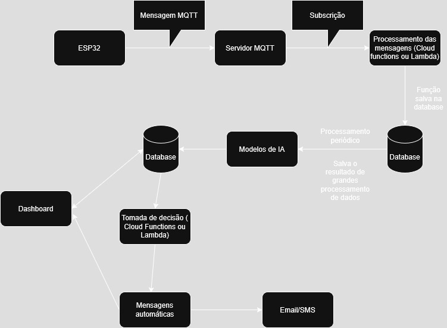

# FIAP - Faculdade de Informática e Administração Paulista

 

# Sprint 1 - Reply 

## Nome do grupo

## 👨‍🎓 Integrantes: 
- <a href="https://www.linkedin.com/in/alice-caroline-marinho">Alice Caroline Marinho de Assis</a>
- <a href="https://www.linkedin.com/company/inova-fusca">Nome do integrante 2</a>
- <a href="https://www.linkedin.com/company/inova-fusca">Nome do integrante 3</a> 
- <a href="https://www.linkedin.com/company/inova-fusca">Nome do integrante 4</a> 
- <a href="https://www.linkedin.com/company/inova-fusca">Nome do integrante 5</a>

## 👩‍🏫 Professores:
### Tutor(a) 
- <a href="https://www.linkedin.com/company/inova-fusca">Lucas Gomes Moreira</a>
### Coordenador(a)
- <a href="https://www.linkedin.com/company/inova-fusca">André Godoi Chiovato</a>

## 📜 Descrição

Este projeto visa o desenvolvimento de uma solução com foco em controle inteligente de processos, monitoramento, dashboards, alertas automáticos e sistemas de predição. Com isso, busca ajudar seus clientes a alcançarem excelência operacional, digitalizando seus ambientes e integrando dispositivos físicos e digitais para gerar dados e insights valiosos em tempo real.

## 🛠 Tecnologias utilizadas
- Python
- NumPy
- Pandas
- Matplotlib
- Scipy
- Seaborn
- C++
- Docker
- Oracle Database / PostgreSQL / Amazon RDS ou Firebase
- MqTT
- TensorFlow / PyTorch

## Considerações

**Como os dados serão coletados a partir de sensores?**

**R:** Os dados serão coletados a partir de sensores conectados a um ESP32 utilizando o protocolo MQTT. O ESP32 atuará como um cliente MQTT, publicando os dados dos sensores em tópicos específicos. O servidor MQTT, que pode ser hospedado em um serviço de nuvem ou em um servidor local, receberá essas mensagens e as encaminhará para uma fila a qual distribuirá para os serviços inscritos.

**Onde os dados serão armazenados?**

**R:** Os dados coletados dos sensores poderão ser armazenados em um banco de dados relacional, como o PostgreSQL ou Oracle Database, hospedado na nuvem (Amazon RDS) ou localmente. Também podem ser armazenados em banco de dados NoSQL, como a Firebase. A escolha do banco de dados dependerá das necessidades específicas da empresa. O local da armazenagem dos dados será definido em conjunto com a equipe de infraestrutura da empresa e também deve ser analisada a necessidade de sigilo dos dados.

**Como será feita a integração com modelos de IA?**

**R:** A integração com modelos de IA será realizada através de APIs RESTful. Os dados coletados dos sensores serão enviados para um serviço que executará os modelos de IA, que podem ser implementados em Python utilizando bibliotecas como TensorFlow ou PyTorch. Os resultados das previsões serão retornados para o sistema e poderão ser armazenados no banco de dados ou utilizados para acionar alertas automáticos.

**Onde ocorrerá o processamento?**

**R:** O processamento dos dados coletados dos sensores ocorrerá em um servidor local ou na nuvem, dependendo da arquitetura escolhida. O uso de contêineres Docker permitirá que o sistema seja facilmente escalável e portátil, facilitando a implementação em diferentes ambientes. A escolha entre processamento local ou na nuvem dependerá das necessidades específicas da empresa, da infraestrutura disponível e preocupação com o sigilo dos dados.

## Requisitos Técnicos e Funcionais

1) Linguagens e ferramentas adequadas para análise de dados e Machine Learning

- Python: Linguagem de programação amplamente utilizada para análise de dados e Machine Learning, com bibliotecas como NumPy, Pandas, Matplotlib e Scipy.

2) Como os dados serão coletados, incluindo o tipo de coleta (simulada ou planejada via sensores como ESP32), armazenados e processados?

- Coleta de dados: Os dados serão coletados a partir de sensores conectados a um ESP32 utilizando o protocolo MQTT. O ESP32 atuará como um cliente MQTT, publicando os dados dos sensores em tópicos específicos. O servidor MQTT, que pode ser hospedado em um serviço de nuvem ou em um servidor local, receberá essas mensagens e as encaminhará para uma fila a qual distribuirá para os serviços inscritos. Um desses serviços será o de armazenagem de dados, que cuidará de sua armazenagem em um dos bancos de dados citados anteriormente.

3) Qual é a justificativa para a escolha de um banco de dados local ou na núvem? Qual é a sua escabilidade e viabilidade em relação ao projeto?

A escolha entre um banco de dados local ou na nuvem deve considerar as necessidades específicas do projeto, a infraestrutura disponível e o nível de exigência quanto disponibilidade dos dados.

Banco de dados local:
A implementação local demanda um investimento inicial elevado, com custos associados à aquisição de servidores, infraestrutura de TI e mão de obra especializada para instalação e manutenção. Além disso, a escalabilidade tende a ser limitada, exigindo novos aportes sempre que for necessário expandir a capacidade. No entanto, pode apresentar melhor desempenho em ambientes com alto volume de acesso interno e menor dependência de conectividade externa.

Banco de dados na nuvem:
Soluções em nuvem oferecem maior flexibilidade e disponibilidade, o modelo de cobrança por demanda reduz o custo inicial e possibilita um controle mais eficiente do orçamento, com escalabilidade praticamente automática conforme o crescimento do projeto. Além disso, os serviços em nuvem geralmente incluem atualizações e suporte técnico contínuo, o que reduz a necessidade de equipe técnica dedicada.

Conclusão:
Para o nosso projeto, os bancos de dados na nuvem apresentam maior viabilidade financeira e operacional, oferecendo uma solução escalável, com alta disponibilidade e menor custo inicial. Já os bancos de dados locais podem ser considerados em situações específicas que demandem desempenho interno superior, desde que se justifique o investimento necessário.

4) Qual é o potencial de uso de serviços em nuvem (como AWS EC2, RDS, Lambda ou similares) na arquitetura proposta, mesmo que simulados na etapa atual?

- Mensagens MQTT: Deve ser observado de perto. Se um sensor ESP32 fizer uma leitura a cada 5 segundos, por exemplo, teríamos 720 leituras por hora. Se tivermos 10 sensores, teríamos 7200 mensagens por hora. Isso pode ser um problema para o servidor MQTT, dependendo do número de clientes conectados e do volume de mensagens. Uma solução seria usar um serviço de nuvem que possa escalar automaticamente, como o AWS IoT Core ou o Google Cloud IoT Core.
- Banco de dados: O uso de um banco de dados relacional na nuvem, como o Amazon RDS ou o Google Cloud SQL, pode facilitar a escalabilidade e a manutenção do banco de dados. Esses serviços oferecem backups automáticos, escalabilidade automática e alta disponibilidade, o que pode ser benéfico para o projeto. Deve-se considerar o custo de armazenamento e transferência de dados, pois esses serviços podem ter custos adicionais dependendo do volume de dados armazenados e transferidos.
- Processamento de dados: O uso de serviços de computação em nuvem, como o AWS Lambda ou o Google Cloud Functions, pode facilitar o processamento de dados em tempo real. Esses serviços permitem que você execute código em resposta a eventos, como a chegada de novas mensagens MQTT ou a atualização de dados no banco de dados. Também será necessário calcular o custo de execução de cada função, pois o custo pode aumentar rapidamente se o volume de dados for alto.

5) Como os dados serão processados e analisados? Quais algoritmos de Machine Learning serão utilizados?

- Processamento de dados: Os dados coletados dos sensores serão processados em tempo real utilizando Python e bibliotecas como NumPy, Pandas e Scipy. O processamento incluirá limpeza, transformação e análise dos dados.
- Análise de dados: A análise dos dados será realizada utilizando algoritmos de Machine Learning, como regressão linear, árvores de decisão e redes neurais. Esses algoritmos serão implementados em Python utilizando bibliotecas como TensorFlow ou PyTorch.
- Predição: Os modelos de Machine Learning serão utilizados para prever eventos futuros com base nos dados coletados dos sensores. As previsões poderão ser utilizadas para acionar alertas automáticos ou para otimizar processos.
- Visualização de dados: A visualização dos dados será realizada utilizando bibliotecas como Matplotlib e Seaborn. Os gráficos e dashboards serão utilizados para apresentar os resultados da análise de dados e das previsões.
- Alertas automáticos: Os alertas automáticos serão acionados com base nas previsões dos modelos de Machine Learning. Os alertas poderão ser enviados por e-mail, SMS ou através de notificações em um aplicativo.

## Esboço da arquitetura

</a>

## Explicação da estratégia de coleta de dados

Não entendi, confirmar com o professor

## Plano inicial de desenvolvimento

- Fase 1: Coleta de dados
    - Coletar dados dos sensores conectados ao ESP32 utilizando o protocolo MQTT.
    - Armazenar os dados em um banco de dados relacional ou NoSQL.
    - Processar os dados em tempo real utilizando Python e bibliotecas como NumPy, Pandas e Scipy.
  
- Fase 2: Análise de dados
    - Analisar os dados coletados utilizando algoritmos de Machine Learning, como regressão linear, árvores de decisão e redes neurais.
    - Implementar os modelos de Machine Learning em Python utilizando bibliotecas como TensorFlow ou PyTorch.
    - Visualizar os dados utilizando bibliotecas como Matplotlib e Seaborn.
    - Criar gráficos e dashboards para apresentar os resultados da análise de dados e das previsões.
     
- Fase 3: Predição
    - Utilizar os modelos de Machine Learning para prever eventos futuros com base nos dados coletados dos sensores.
    - Acionar alertas automáticos com base nas previsões dos modelos de Machine Learning.
    - Enviar os alertas por e-mail, SMS ou através de notificações em um aplicativo.

- Fase 4: Integração com APIs
    - Integrar os modelos de Machine Learning com APIs RESTful para permitir a comunicação entre diferentes serviços.
    - Implementar as APIs utilizando frameworks como Flask ou FastAPI.
    - Documentar as APIs utilizando Swagger ou Postman.
    - Criar testes automatizados para as APIs utilizando bibliotecas como pytest ou unittest.

- Fase 5: Implementação de contêineres Docker
    - Implementar contêineres Docker para facilitar a escalabilidade e portabilidade do sistema.
    - Criar um Dockerfile para cada serviço do sistema.
    - Utilizar o Docker Compose para orquestrar os contêineres.
    - Criar testes automatizados para os contêineres utilizando bibliotecas como pytest ou unittest.

- Fase 6: Implementação de testes automatizados
    - Implementar testes automatizados para o sistema utilizando bibliotecas como pytest ou unittest.
    - Criar testes unitários, de integração e de aceitação para garantir a qualidade do código.
    - Utilizar ferramentas de integração contínua (CI) para executar os testes automatizados em cada commit.

- Fase 7: Documentação
    - Criar uma documentação clara e concisa para facilitar a compreensão do sistema.
    - Utilizar ferramentas de geração de documentação automática para manter a documentação atualizada.

- Fase 8: Implementação de melhorias
    - Implementar melhorias no sistema com base no feedback dos usuários e nas análises de desempenho.
    - Realizar testes de carga e estresse para garantir que o sistema possa lidar com grandes volumes de dados.
    - Monitorar o desempenho do sistema e realizar ajustes conforme necessário.
    - Implementar melhorias na interface do usuário para facilitar a interação com o sistema.

## 🗃 Histórico de lançamentos

* 0.1.0 - 04/05/2025
    *

## 📋 Licença

<a property="dct:title" rel="cc:attributionURL" href="https://github.com/agodoi/template">MODELO GIT FIAP</a> por <a rel="cc:attributionURL dct:creator" property="cc:attributionName" href="https://fiap.com.br">Fiap</a> está licenciado sobre <a href="http://creativecommons.org/licenses/by/4.0/?ref=chooser-v1" target="_blank" rel="license noopener noreferrer" style="display:inline-block;">Attribution 4.0 International</a>.

